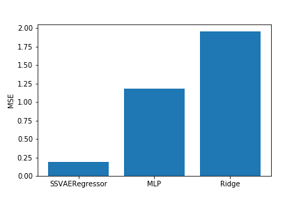

# Semi-Supervised Variational AutoEncoder for Regression

The code implements "Semi-Supervised Learning with Deep Generative Models" (https://arxiv.org/abs/1406.5298) and extends it for multimodal regression cases. Please see SSVAE_development.ipynb for how to run the code.

# Performance

Here is the performance of some regression models with 1000 MNIST labeled examples. SSVAE regeressor makes use of additional 53000 unlabeled examples. Both MLP and SSVAE uses fully connected net with 256 and 64 hidden layers.

