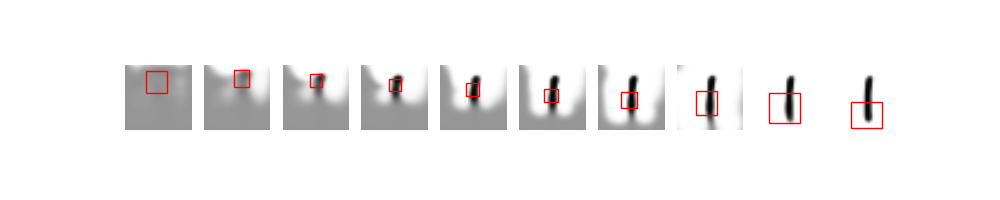
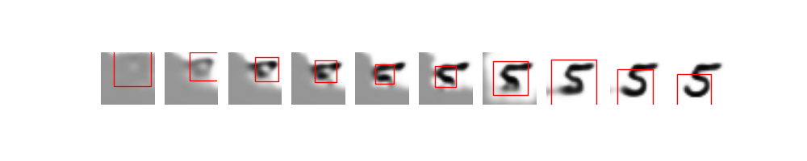
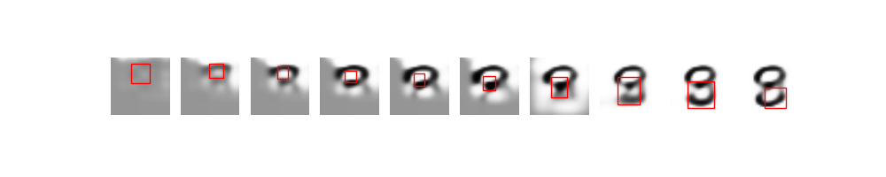
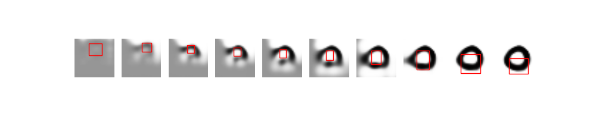

# Deep Recurrent Attentive Writer

Yet another implementation of DRAW architecture from (https://arxiv.org/pdf/1502.04623.pdf)

## Explanation
The model combines the following two concepts:
- Recurrent variational autoencoder
- Attention with differentiable guassian filter

## MNIST Result 
Here is the result of training the DRAW architecture for 10 drawing steps on MNIST data for 30 epochs.
1. Reconstruction given training samples

2. Generation from latent distributions.

Send me questions at hiranumn at cs dot washignton dot edu.
