# DC-GAN simple implementation

## Architecture
2 conv layers for a generative network and 2 deconv layers for a discriminator.   
Both conv fitlers are 5 by 5 with strides.   
Dense layers are added to reshape tensors into desired dimentions.  

## Results
- generated MNSIT samples 

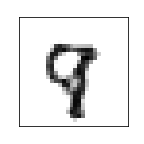
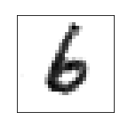
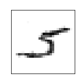
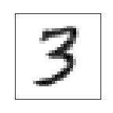
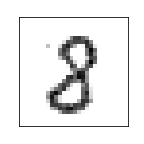
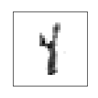
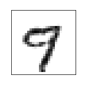
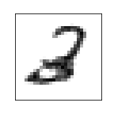
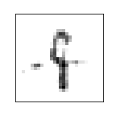
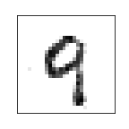

- learning curves
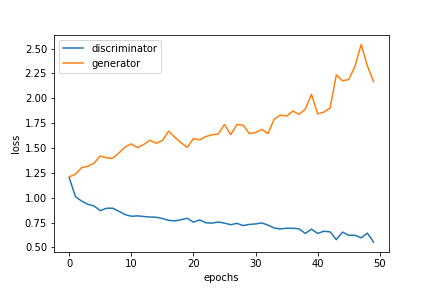
